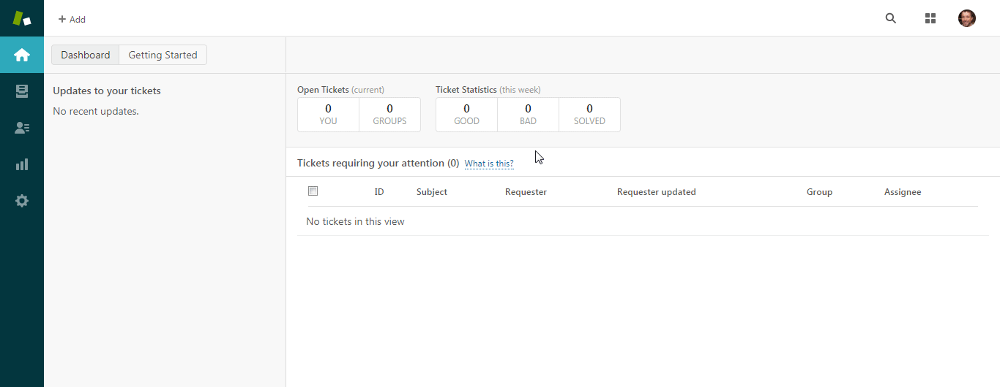
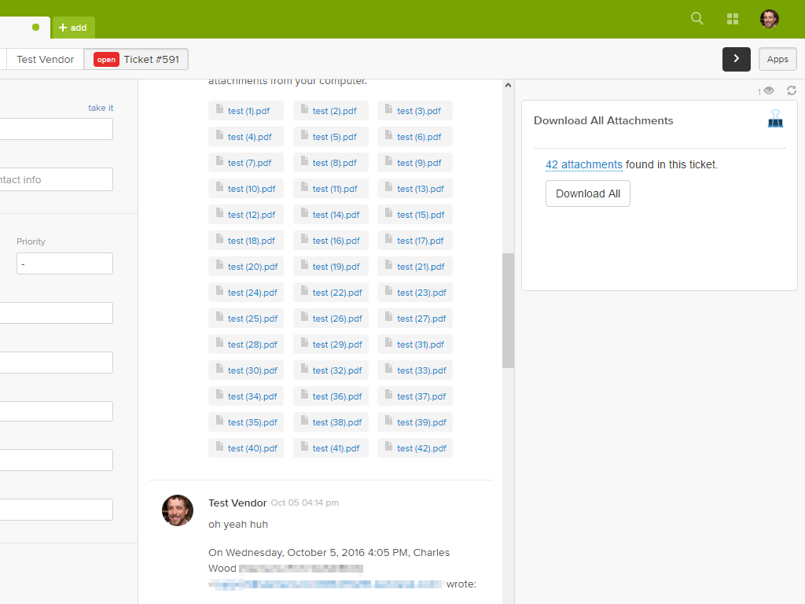
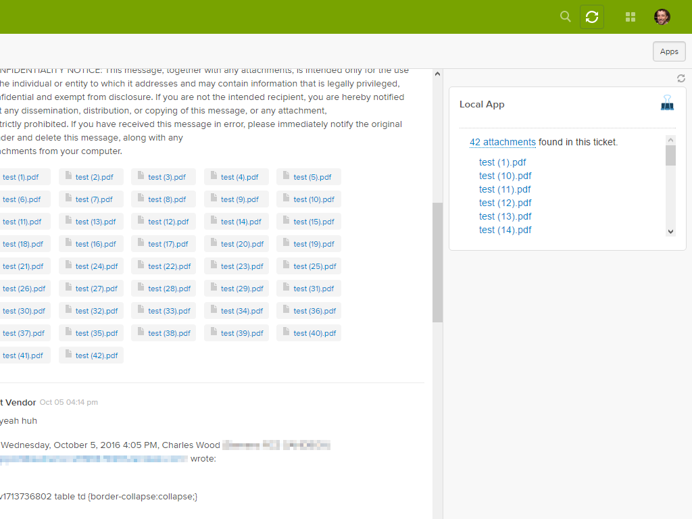
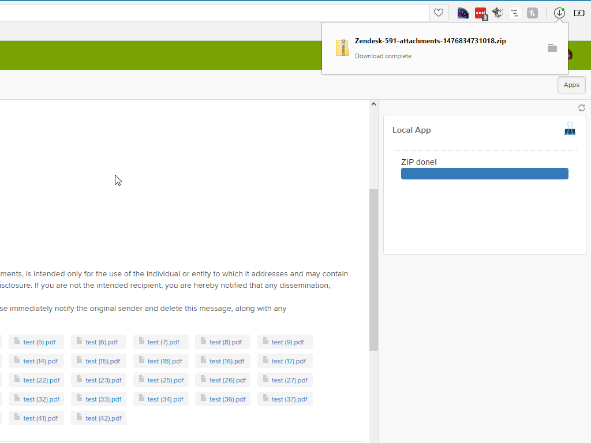

## Download All Attachments

Tired of downloading a million Zendesk attachments one... at... a... time? I was, so I made this app. Download all attachments from a ticket with one click!

There's nothing to it:

* Install the app via the marketplace and it will show up in the sidebar.
* If a ticket has attachments, you get a "Download All Attachments" button.
* Click that button to have a ZIP of all attachments downloaded to your computer.

This app does all its work directly in the browser, making it a safe choice for corporate environments.

### OPTIONS

* You can click on the count of attachments (e.g., "4 attachments found") to get a list of all attachments.
* If you want to download all of the files individually instead of in a ZIP, you can disable the ZIP functionality in the app's settings page.
  * Your app's settings page is at Admin > Manage > Download All Attachments > App Configuration.

  .

### DISCLAIMERS

* This app is built with relatively new technology, so it may not work in older browsers. It has been tested in recent versions of Chrome, Firefox, IE, Edge, and Opera, but I can't make any guarantees that it will work in your particular environment.
* This app is 100% JavaScript, so it can't reliably be made to ask you where you want to save the ZIP. Your browser will probably just save the ZIP to wherever it usually saves things. This is typically a "Downloads" folder, and the browser should pop up a notification about it. See the screenshots for an example.
* This app is a side-project to my day job, so I can only support it in my free time (which is limited, because I also have small children). So, bear that in mind :)

Feel free to send any questions or feedback to charles.adrian.wood@gmail.com.

Source code is maintained at [https://github.com/chuck-wood/download-all-attachments](https://github.com/chuck-wood/download-all-attachments). Pull requests and issues are welcome.

Icons made by [Freepik](http://www.flaticon.com/authors/freepik) from [www.flaticon.com](http://www.flaticon.com). Licensed by [CC 3.0 BY](http://creativecommons.org/licenses/by/3.0/).

### Screenshots:

